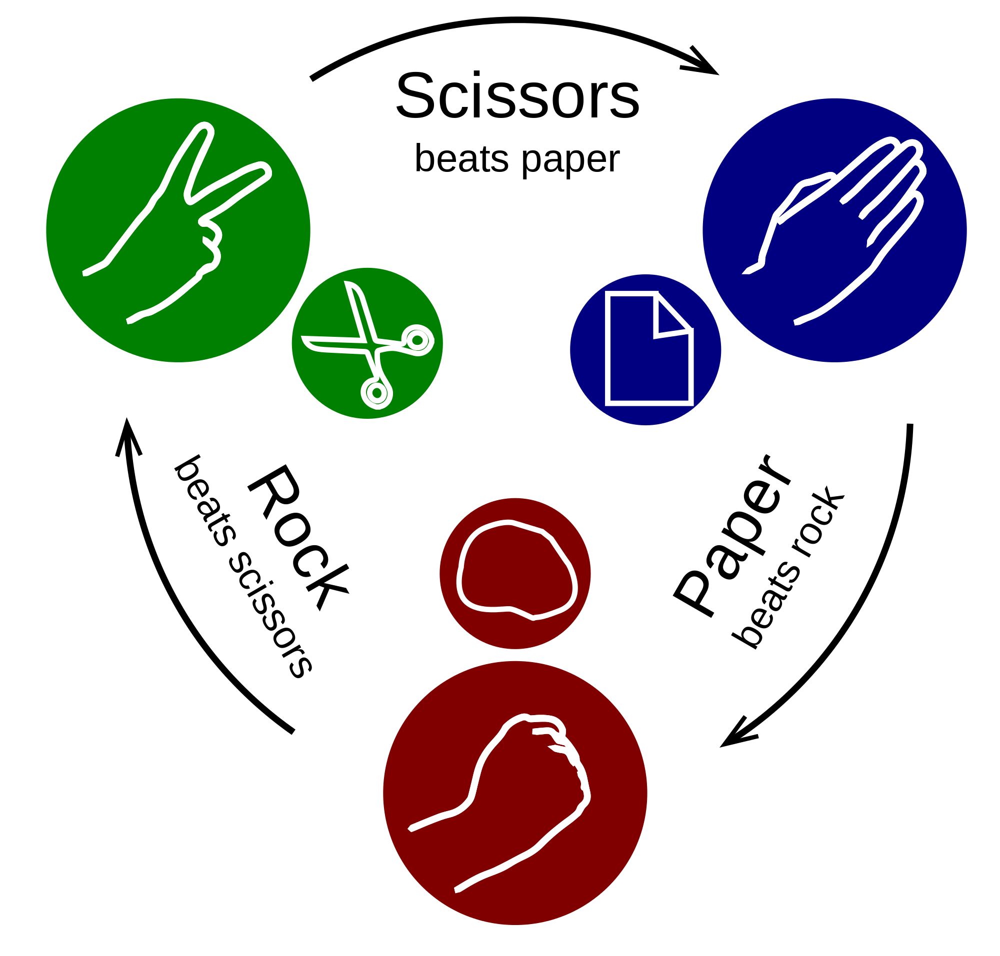
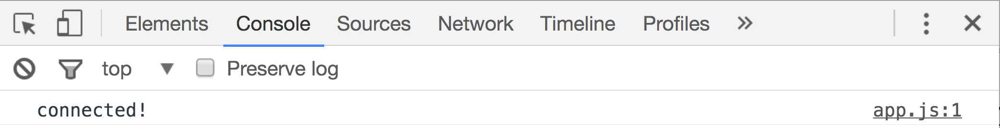
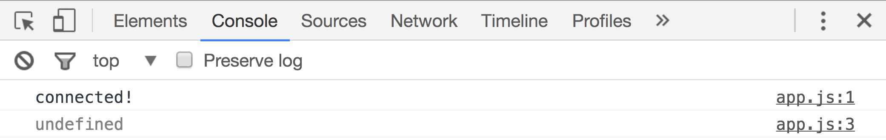
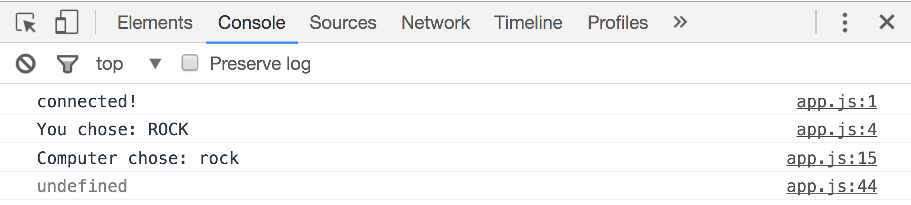

# Rock Paper Scissors with Debugging

This afternoon we're going to take what you learned this morning about JavaScript and put it into practice. Let's build a game! As we go, we'll be talking about debugging tools. We'll get some errors on purpose so we can practice dealing with them 😉

## Pseudocode!

Before we start writing our code, let's do some pseudocoding!

From wikipedia:
> Pseudocode is an informal high-level description of the operating principle of a computer program or other algorithm. It uses the structural conventions of a programming language, but is intended for human reading rather than machine reading.

What does this mean? Basically, pseudocode is a method you can use to plan out how to code something without worrying about syntax. It's like a rough draft or a sketch.

Let's pseudocode the rules of rock paper scissors.

## Set Up

Now that we have a "rough draft" of our rock paper scissors program, let's set up our files so we can start coding.

Go to your desktop and make a new directory.

```bash
cd ~/Desktop
mkdir rock-paper-scissors
cd rock-paper-scissors
```

Next, let's make two files. We'll need an HTML file (that's what we'll open in the browser) and a JavaScript file (that's where we'll write all of the logic for our game).

```bash
mkdir js
touch index.html js/app.js
```

Open the rock-paper-scissors directory in Sublime.

#### Connect JS to HTML

Just like with CSS, our JavaScript files need to be connected to our HTML document.

First, set up the HTML boilerplate (`html` + *tab*). Now let's bring in our JavaScript file. With CSS we use a `<link>` tag; with JavaScript we use a `<script>` tag. Add this script tag in the `<head>`:

```html
<script type="text/javascript" src="./js/app.js"></script>
```

If your project includes DOM manipulation (which we will cover tomorrow), the JavaScript needs to load *after* all of the HTML loads. Since there's no DOM manipulation in this project, we can load the JavaScript first, so it's fine where it is.

At this point, your entire HTML document should be:

```html
<!DOCTYPE html>
<html>
<head>
  <title>Rock Paper Scissors</title>
  <script type="text/javascript" src="./js/app.js"></script>
</head>
<body>
</body>
</html>
```

Now let's check the connection. Add this line to your JavaScript file:

```js
console.log('connected')
```

Open your HTML file in the browser and then open the Chrome Developer Tools (`command option i`) and click on the **console** tab. You should see this:



Our JavaScript is connected to our HTML!

#### A note about semicolons

Semicolons in JavaScript are required in some cases, optional in some cases, and not allowed in some places. If you choose to use semicolons where they are optional, be consistent! Make sure *not* to use semicolons where they are not allowed. [Here](https://www.codecademy.com/blog/78) is an article outlining where semicolons are required, optional, and not allowed.

## Loading

Add these lines to your JavaScript file:

```js
console.log(lang)
var lang = 'JavaScript'
```



Notice that when we logged the variable `lang` to the console, it returned `undefined`. If you type `lang` into the console and press enter it will print "JavaScript", not `undefined`. 


 
JavaScript reads from top to bottom. When line 3 ran, line 4 hadn't run yet, so the variable `lang` was undefined at that moment. Let's keep that in mind as we write our Rock Paper Scissors program.

## Rock Paper Scissors Code Along

Remember, we're also going to learn about how to deal with errors during this code along, so I will make sure we get some errors along the way. Don't worry! Reading and dealing with errors is an important part of the development process.

> Note: We're going to do this code along by following the pseudocode we wrote together, so we might not go in the exact order of this markdown. The rest of this markdown serves as a reference for *one way* we could code this game.

#### User Move

One way that we can get user input to use in our code is to use `prompt`.

From [W3 Schools](http://www.w3schools.com/jsref/met_win_prompt.asp):

> The prompt() method displays a dialog box that prompts the visitor for input.

Add a prompt to your JS file:

```js
prompt('What is your move?')
```

Cool. But we don't have the moved stored anywhere. Let's assign the prompt to a variable:

```js
var userChoice = prompt('What is your move?')
```

Now if you refresh your browser and enter a choice, you can then type `userChoice` in the console and it will return the value that you entered into the prompt.

#### Computer Move

Rock Paper Scissors only makes sense with an opponent, so let's make a "computer" player to compete with!

Instead of using a prompt to get input from a user, we're going to use `Math.random()` to get a random choice from the computer.

The `Math.random()` method will return a number between 0 and 1 (including 0, but not including 1).

Type `Math.random()` into your console.

Let's add a variable to our JS file which stores the response of `Math.random()`:

```js
var computerChoice = Math.random()
```

How is a number like `0.26318418871831106` helpful to us? We can use the result of `Math.random()` to reassign the computer's move to "rock," "paper," or "scissors." We'll do that with a conditional.

First, we'll define the choices:

- If `Math.random()` returns a value less than 0.34, the computer chooses "rock"
- If `Math.random()` returns a value between 0.34 and 0.67, the computer chooses "paper"
- If `Math.random()` returns a value higher than 0.67, the computer chooses "scissors"

These three possibilities are dependent on *conditions*, so let's write out our conditional:

```js
if (computerChoice < 0.34) {
  computerChoice = 'rock';
} else if(computerChoice <= 0.67) {
  computerChoice = 'paper';
} else {
  computerChoice = 'scissors';
}
```

Why does our `else if` not specify that the number is higher than 0.34? 🤔

Notice that we don't use the keyword `var` anywhere in our conditional. That's because we're not creating a new variable, just changing the value of an existing variable.

Go ahead and refresh your browser, enter your move, and then check out the values of `userChoice` and `computerChoice` in the console.

#### Logging Moves to the Console

Instead of typing `userChoice` and `computerChoice` into the console every time we refresh our broswer, we can add `console.log()` statements to our JS file to save us a little time. Let's add those now! Your JS file should now look like this:

```js
console.log('connected!')

var userChoice = prompt('What is your move?')
console.log('You chose: ' + userChoice)

var computerChoice = Math.random()
if (computerChoice < 0.34) {
  computerChoice = 'rock'
} else if(computerChoice <= 0.67) {
  computerChoice = 'paper'
} else {
  computerChoice = 'scissors'
}
console.log('Computer chose: ' + computerChoice)
```

**Where** you put the `console.log()` statements matters. Make sure it is *below* the where the variable is defined, or where it is updated (in the case of `computerChoice`).

#### Win Logic

Now we have to actually compare the user's move and the computer's move to see who won. Let's review the rules of the game: rock beats scissors, scissors beats paper, and paper beats rock.

One way to do this is with a function. We can give our function two parameters and use the user's choice and computer's choice as arguments to run the function.

###### Declaration vs. Expression

There are two ways to define functions, declaration and expression.

Function declaration is the syntax we went over this morning:

```js
function myFunc(){
}
```

Function expression is similar to writing other variables:

```js
var myFunc = function(){
}
```

One main difference is *hoisting*. Hoisting basically means that we can call the function above where it is written in the code **if** it is defined using a function declaration. Functions defined using function expression syntax can only be called below where they are written.

A good name for our function is `compare`. Let's start there:

```js
function compare(){
}
```

Since this is written in the function declaration syntax, we can write it at the bottom of our file, below the code we already have, and still call it higher up in the file.

Let's pseudocode our function before filling it in.

Now let's fill in our function:

```js
function compare(choice1, choice2){
  var message
  if (choice1 === choice2) {
    message = 'The result is a tie!'
  } else if (choice1 === 'rock') {
    if (choice2 === 'scissors') {
      message = 'rock wins - congratulations!'
    } else {
      message = 'paper wins - rematch?'
    }
  } else if (choice1 === 'paper') {
    if (choice2 === 'rock') {
      message = 'paper wins - congratulations!'
    } else {
      message = 'scissors wins - rematch?'
    }
  } else if (choice1 === 'scissors') {
    if (choice2 === 'rock') {
      message = 'rock wins - rematch?'
    } else {
      message = 'scissors wins - congratulations!'
    }
  }
  console.log(message)
}
```

Now we need to call the compare function, using the user's choice and computer's choice as arguments.

```js
compare(userChoice, computerChoice)
```

Save your file, refresh your browser window and check it out!

#### Dealing with User Input

There are some issues we should deal with. Refresh your broswer window and enter "ROCK" in all capital letters in the prompt.



**WHAT?**  


JavaScript, like pretty much everything in the world of programming, is *case sensitive*. "ROCK" is not the same as "rock." Should we just tell the user to only use lower case letters? Should we add more `else if`s to our compare function for all caps versions? No and no. We can just add a method to our userChoice variable assignment.

```js
var userChoice = prompt('What is your move?').toLowerCase()
```

That's not a typo, the `c` is capitalized, even though "lowercase" is one word in English. `¯\_(ツ)_/¯`

That method, `toLowerCase()` takes the value from our prompt and converts it to all lowercase letters. Awesome! Check it out in the broswer now; if you enter "ROCK" into the prompt, everything works fine now.


Another issue we could encounter when dealing with user input is typos or other words entirely. What if some smart alec enters "Lizzard" or "Spock"? Let's Add another conditional to deal with that.

If the user's choice is one of the three valid choices, we'll have the computer make a move and compare the two moves, otherwise, we'll just tell the user that their input was invalid.

```js
if (userChoice === 'rock' || userChoice === 'paper' || userChoice === 'scissors') {
  var computerChoice = Math.random()
  if (computerChoice < 0.34) {
    computerChoice = 'rock'
  } else if(computerChoice <= 0.67) {
    computerChoice = 'paper'
  } else {
    computerChoice = 'scissors'
  }
  console.log('Computer chose: ' + computerChoice)
  compare(userChoice, computerChoice)
} else {
  console.log('That is not a valid move!')
}
```

Your JavaScript file in its entirety now looks like this:

```js
console.log('connected!')

var userChoice = prompt('What is your move?').toLowerCase()
console.log('You chose: ' + userChoice)

if (userChoice === 'rock' || userChoice === 'paper' || userChoice === 'scissors') {
  var computerChoice = Math.random()
  if (computerChoice < 0.34) {
    computerChoice = 'rock'
  } else if(computerChoice <= 0.67) {
    computerChoice = 'paper'
  } else {
    computerChoice = 'scissors'
  }
  console.log('Computer chose: ' + computerChoice)
  compare(userChoice, computerChoice)
} else {
  console.log('That is not a valid move!')
}

function compare(choice1, choice2){
  var message
  if (choice1 === choice2) {
    message = 'The result is a tie!'
  } else if (choice1 === 'rock') {
    if (choice2 === 'scissors') {
      message = 'rock wins - congratulations!'
    } else {
      message = 'paper wins - rematch?'
    }
  } else if (choice1 === 'paper') {
    if (choice2 === 'rock') {
      message = 'paper wins - congratulations!'
    } else {
      message = 'scissors wins - rematch?'
    }
  } else if (choice1 === 'scissors') {
    if (choice2 === 'rock') {
      message = 'rock wins - rematch?'
    } else {
      message = 'scissors wins - congratulations!'
    }
  }
  console.log(message)
}
```

#### Refactor

One important part of programming is *refactoring*. When you're writing code, you don't have to write it in the most efficient way first, just make it work. After it works, you can refactor it, which means rewrite the code so that it does the same thing, but in fewer lines of code.

Let's refactor how the computer chooses its move. Right now we have that written in 8 lines of code:

```js
var computerChoice = Math.random()
if (computerChoice < 0.34) {
  computerChoice = 'rock'
} else if(computerChoice <= 0.67) {
  computerChoice = 'paper'
} else {
  computerChoice = 'scissors'
}
```

Let's rewrite it in only 2 lines! First we'll define an array of options:

```js
var options = ['rock', 'paper', 'scissors']
var computerChoice = options[Math.floor(Math.random() + options.length)]
```

Let's walk through that piece by piece.

## Conclusion

You've just built a rock paper scissors game in the console! 🎉

Tomorrow, we'll add HTML and CSS so we can click on images of moves instead of typing into a prompt box.